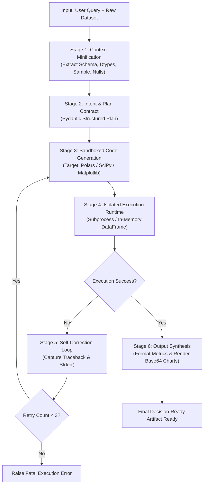

# Comprehensive Guide: Building an Autonomous Data Analytics AI Agent with LangGraph

## 1. Introduction & Theoretical Architecture

Traditional LLM workflows rely on linear, single-shot prompts (e.g., prompt -> LLM -> answer). When dealing with tabular data analysis, linear pipelines suffer from three fatal flaws:
1. **Context Window Saturation**: Passing raw CSVs or large DataFrames into LLM prompts quickly blows through token limits, drives up latency and API cost, and causes "needle-in-a-haystack" hallucination.
2. **Code Hallucination & Execution Fragility**: LLMs frequently generate code with syntax errors, deprecated methods, or incorrect column references. Without an automated runtime feedback loop, the user receives broken code.
3. **Security Risks**: Executing LLM-generated code directly inside the application process exposes system environments to memory leaks, arbitrary code injection, and unconstrained resource exhaustion.

To overcome these challenges, we design a state-machine-driven **Autonomous AI Agent** using **LangGraph**, **Polars**, **SciPy**, and **Matplotlib**, featuring **Dual LLM Provider Support** (Local Ollama and OpenAI API).

---

## 2. Agent Workflow Architecture

The agent implements a cyclic directed graph (StateGraph) adhering to the 6-stage workflow:



---

## 3. Deep Dive into the 6 Stages

### Stage 1: Context Minification
* **Objective**: Provide the LLM with 100% of the semantic information required to write analytical code, using less than 2% of the token footprint.
* **Mechanism**: Using **Polars** (which outperforms Pandas by 5-20x in memory efficiency and speed), we profile:
  - Dataset shape (total rows, columns)
  - Column names and strict Polars data types (`Int64`, `Float64`, `String`, `Date`, etc.)
  - Missing value counts and percentage nulls per column
  - Approximate distinct counts (cardinality)
  - Numeric 5-number summary (mean, std, min, median, max)
  - Head sample (3-5 rows) as markdown table
* **Token Efficiency**: Reduces a 50MB CSV down to ~500 tokens of structured markdown metadata.

### Stage 2: Intent & Plan Contract (Pydantic Structured Plan)
* **Objective**: Enforce an explicit reasoning step before any code is generated.
* **Mechanism**: The LLM outputs a structured `AnalyticalPlan` validated by Pydantic:
  - `primary_intent`: Core business or analytical question to solve
  - `hypotheses`: Data hypotheses to validate
  - `data_transformations`: Required filtering, grouping, aggregation, or windowing
  - `statistical_methods`: Hypotheses tests (e.g., Pearson/Spearman correlation, t-test, ANOVA, Mann-Whitney from `scipy.stats`)
  - `visualization_plan`: Chart types, axes, palettes, and styling
  - `required_metrics`: Specific scalar values to export

### Stage 3: Sandboxed Code Generation
* **Objective**: Generate clean, self-contained, and deterministic Python code adhering to an execution contract.
* **Target Libraries**:
  - **Polars** (`import polars as pl`): High-performance tabular data manipulation.
  - **SciPy** (`from scipy import stats`): Rigorous statistical analysis.
  - **Matplotlib** (`import matplotlib.pyplot as plt`): Clean, headless visualization (`matplotlib.use('Agg')`).
* **Output Contract**: The generated script must serialize its results into a structured JSON file containing:
  - `metrics`: Dictionary of computed scalars, statistical p-values, correlations, and aggregated summaries.
  - `artifacts`: Base64-encoded PNG image strings of generated charts.
  - `summary`: Programmatic summary of key findings.

### Stage 4: Isolated Execution Runtime
* **Objective**: Run the generated code in a secure, isolated environment without crashing the agent process.
* **Mechanism**:
  - The generated script is written to an ephemeral scratch directory.
  - It is executed in a dedicated child `subprocess` using `sys.executable`.
  - Wall-clock timeout (e.g., 30 seconds) protects against infinite loops.
  - Standard output (`stdout`), standard error (`stderr`), and exit code are captured.
  - In-memory data passing or file-based memory caching ensures zero process memory leakage.

### Stage 5: Self-Correction Loop
* **Objective**: Automatically repair code errors without human intervention.
* **Mechanism**:
  - If the subprocess fails (exit code != 0 or JSON output missing), the node extracts the full Python traceback and stderr.
  - The agent checks: `retry_count < 3`.
  - If within retry budget:
    - `retry_count` is incremented.
    - Error traceback and previous code attempt are appended to the agent's memory.
    - The graph loops back to **Stage 3** (Sandboxed Code Generation), with targeted system instructions to analyze the exact traceback and patch the bug.
  - If retry budget exhausted:
    - The graph routes to `Raise Fatal Execution Error` with full diagnostic telemetry.

### Stage 6: Output Synthesis
* **Objective**: Transform raw numbers and charts into an executive-level, decision-ready artifact.
* **Mechanism**:
  - Takes the executed metrics, chart metadata, and original analytical plan.
  - The LLM synthesizes an executive summary, answers the user's primary intent, interprets statistical significance (p-values, effect sizes), and embeds the generated charts inline using Base64 data URIs.
  - Exports a rich Markdown / HTML artifact ready for stakeholders.

---

## 4. Dual LLM Strategy: Local Ollama vs OpenAI API

Our agent implements a unified LLM factory pattern supporting two operational modes:

| Feature | Local LLM (Ollama) | Cloud LLM (OpenAI API) |
| :--- | :--- | :--- |
| **Primary Use Case** | Air-gapped, privacy-first, zero API cost | High-complexity reasoning, massive schemas |
| **Recommended Models** | `llama3.2`, `qwen2.5-coder`, `mistral`, `deepseek-r1` | `gpt-4o`, `gpt-4o-mini` |
| **Configuration** | `OLLAMA_BASE_URL=http://localhost:11434` | `OPENAI_API_KEY=sk-...` |
| **Structured Outputs** | Supported via `ChatOllama.with_structured_output` | Native JSON schema mode via `ChatOpenAI` |
| **Offline Operation** | Yes (100% offline) | No (Requires internet connection) |

### Switching Between Providers
The agent dynamically selects the provider based on CLI flag `--provider ollama` or `--provider openai`, falling back to `.env` settings.

```bash
# Run with Local Ollama
python -m src.main --dataset data/sample.csv --query "Analyze revenue drivers" --provider ollama --model llama3.2

# Run with OpenAI API
python -m src.main --dataset data/sample.csv --query "Analyze revenue drivers" --provider openai --model gpt-4o-mini
```

---

## 5. Security & Isolation Guidelines

1. **Subprocess Boundary**: All untrusted generated code runs in a separate child process. The main LangGraph orchestrator never runs `eval()` or `exec()` in its own memory space.
2. **Headless Display**: Code sets `matplotlib.use('Agg')` to prevent GUI rendering errors on headless servers or Windows background tasks.
3. **Timeout Protection**: Child process execution is bounded by an explicit timeout parameter (`timeout=45s`) to guard against deadlocks or runaway calculations.
4. **Clean Ephemeral Cleanup**: Scratch files, temporary scripts, and intermediate data frames are cleaned up or sandboxed within dedicated execution folders.

---

## 6. Project Structure

```
ai_agent_01/
├── .venv/                         # Virtual environment
├── .env                           # API keys & model configs
├── .env.example                   # Configuration template
├── requirements.txt               # Locked dependencies
├── AI_AGENT_DEVELOPMENT_GUIDE.md  # Architectural guide
├── data/
│   └── sample_sales_data.csv      # Sample enterprise dataset
└── src/
    ├── __init__.py
    ├── config.py                  # Dual LLM factory (Ollama/OpenAI)
    ├── contracts.py               # Pydantic schemas (Plan, Context, Metrics)
    ├── state.py                   # LangGraph AgentState
    ├── minifier.py                # Polars-based dataset context minifier
    ├── nodes.py                   # The 6 workflow nodes
    ├── graph.py                   # LangGraph StateGraph & routing logic
    └── main.py                    # CLI entrypoint & report generation
```

