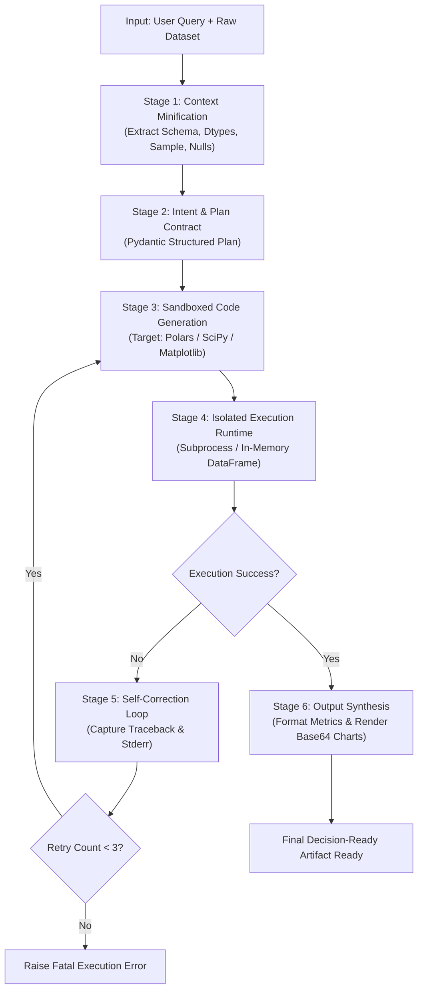

# AI Agent 01 — Autonomous Data Analytics Agent (LangGraph)

An autonomous data analytics AI agent built with **LangGraph**, **Polars**, **SciPy**, and **Matplotlib**. Given a tabular dataset and an analytical question, the agent plans, generates, executes, and self-corrects Python analysis code in a sandboxed runtime, then produces a **decision-ready report** in Markdown and HTML — no human intervention required.

The agent supports a **dual LLM strategy**: a fully offline local model via [Ollama](https://ollama.com) or a cloud model via the OpenAI API, plus a mock engine for testing.

> 📚 Full architectural deep-dive: [`AI_AGENT_DEVELOPMENT_GUIDE.md`](./AI_AGENT_DEVELOPMENT_GUIDE.md)

---

## ✨ Features

- **6-stage cyclic LangGraph workflow** — natural-language query → statistical insight to decision-ready artifact
- **Context Minification** — profiles datasets (schema, dtypes, nulls, cardinality, 5-number summaries) into <2% of the raw token footprint using Polars
- **Structured planning** — Pydantic-validated analytical plans (hypotheses, transformations, statistical methods, visualization plan)
- **Sandboxed code execution** — LLM-generated code runs in an isolated `subprocess` with a wall-clock timeout; the orchestrator never executes untrusted code in its own process
- **Autonomous self-correction** — executes up to `MAX_RETRY_COUNT` (default 3) repair loops feeding tracebacks back to the code generator
- **Dual LLM providers** — local Ollama (`llama3.2`, `qwen2.5-coder`, ...) or OpenAI (`gpt-4o-mini`, ...), switchable at runtime
- **Rich reports** — executive summaries, statistical significance (p-values, correlations), and Base64-embedded charts exported to Markdown **and** styled HTML
- **Mock LLM engine** — deterministic offline execution for CI and unit tests
- **Windows-friendly** — UTF-8 output handling and headless `matplotlib` (`Agg`) rendering

## 🏗️ How It Works



## 🚀 Getting Started

### Prerequisites

- **Python 3.10+**
- An LLM runtime, **either**:
  - **Ollama** (default) — installed and running locally on `http://localhost:11434` with a model pulled (e.g. `ollama pull llama3.2`), **or**
  - **OpenAI** — an API key (`sk-...`)

### Installation

```bash
# 1. Clone the repository
git clone https://github.com/bilalhaider-ux/ai_agent_01.git
cd ai_agent_01

# 2. Create and activate a virtual environment
python -m venv .venv
# Windows:
.venv\Scripts\activate
# macOS / Linux:
source .venv/bin/activate

# 3. Install dependencies
pip install -r requirements.txt

# 4. Configure environment
cp .env.example .env   # Windows: copy .env.example .env
# Then edit .env to set your provider, model, and (if OpenAI) API key
```

### Configuration

All runtime behaviour is driven by environment variables (see [`.env.example`](./.env.example)):

| Variable | Default | Description |
| :--- | :--- | :--- |
| `LLM_PROVIDER` | `ollama` | `ollama`, `openai`, or `mock` |
| `OPENAI_API_KEY` | — | Required when `LLM_PROVIDER=openai` |
| `OPENAI_MODEL` | `gpt-4o-mini` | OpenAI model name |
| `OLLAMA_BASE_URL` | `http://localhost:11434` | Ollama server endpoint |
| `OLLAMA_MODEL` | `llama3.2` | Ollama model name |
| `MAX_RETRY_COUNT` | `3` | Self-correction retry budget |
| `EXECUTION_TIMEOUT_SECONDS` | `45` | Sandboxed runtime timeout |

### Usage

```bash
# Run with the bundled sample dataset and Ollama (default)
python -m src.main

# Run with a custom dataset and query (local Ollama)
python -m src.main \
  --dataset data/sample_sales_data.csv \
  --query "Analyze product category revenue and customer rating correlation with returns" \
  --provider ollama --model llama3.2

# Run with OpenAI
python -m src.main \
  --dataset data/sample_sales_data.csv \
  --query "Analyze revenue drivers by category" \
  --provider openai --model gpt-4o-mini

# Run fully offline with the mock LLM (no server required)
python -m src.main --provider mock

# Disable HTML export
python -m src.main --no-html

# Custom output artifact path
python -m src.main --output results/report.md
```

**CLI options**

| Flag | Default | Description |
| :--- | :--- | :--- |
| `--dataset` | `data/sample_sales_data.csv` | Path to CSV file |
| `--query` | *(built-in analytical question)* | The question to answer |
| `--provider` | from `.env` | `ollama`, `openai`, or `mock` |
| `--model` | from `.env` | Model name override |
| `--output` | `decision_ready_artifact.md` | Markdown artifact path |
| `--no-html` | `False` | Skip HTML report export |

### Output

The agent writes two artifacts to the current directory:

- `decision_ready_artifact.md` — Markdown report with metrics, findings, and charts
- `decision_ready_artifact.html` — styled, browser-ready version of the same report

An example result is committed in [`decision_ready_artifact.md`](./decision_ready_artifact.md).

## 🧪 Testing

Tests use Python's built-in `unittest` framework and require **no LLM server** (the mock engine is used for full-pipeline invocation):

```bash
python -m unittest discover -s tests -v
```

## 📁 Project Structure

```
ai_agent_01/
├── .venv/                         # Virtual environment
├── .env                           # API keys & model configs (git-ignored)
├── .env.example                   # Configuration template
├── requirements.txt               # Python dependencies
├── AI_AGENT_DEVELOPMENT_GUIDE.md  # Architectural deep-dive
├── data/
│   └── sample_sales_data.csv      # Sample enterprise dataset
├── src/
│   ├── __init__.py
│   ├── config.py                  # Dual LLM factory (Ollama / OpenAI / mock)
│   ├── contracts.py               # Pydantic schemas (Plan, Context, Metrics)
│   ├── state.py                   # LangGraph AgentState
│   ├── minifier.py                # Polars-based dataset context minifier (Stage 1)
│   ├── mock_llm.py                # Deterministic offline LLM for testing
│   ├── executor.py                # Sandboxed subprocess runtime (Stage 4)
│   ├── nodes.py                   # The 6 workflow stages + fatal-error node
│   ├── graph.py                   # LangGraph StateGraph, routing, and retry loop
│   └── main.py                    # CLI entrypoint & report generation
├── tests/
│   └── test_agent_pipeline.py     # Unit + integration test suite
└── decision_ready_artifact.md     # Sample generated report
```

## 🔒 Security Notes

- LLM-generated code **never** runs in the orchestrator's process — it executes in an isolated child `subprocess` with a strict timeout and is cleaned up afterward.
- Headless `matplotlib` (`Agg`) avoids GUI crashes on servers and background tasks.
- Never commit your real `.env` file — it contains API keys.

## 🤝 Contributing

Contributions are welcome! See [`CONTRIBUTING.md`](./CONTRIBUTING.md) for guidelines on reporting issues, setting up your environment, coding style, and the pull-request workflow.

## 📄 License

This project is licensed under the [MIT License](./LICENSE).